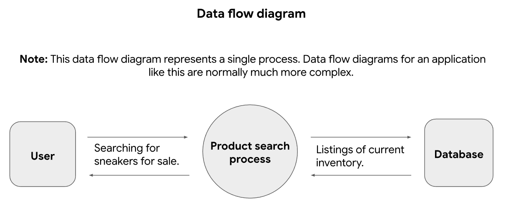
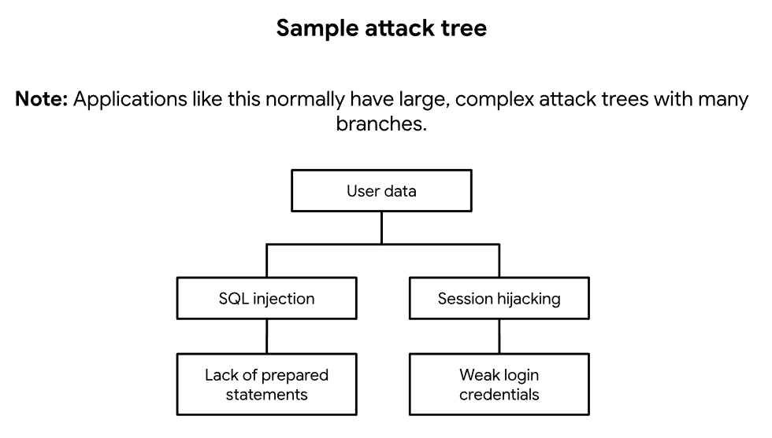

# Scenario

You’re part of the growing security team at a company for sneaker enthusiasts and collectors. The business is preparing to launch a mobile app that makes it easy for their customers to buy and sell shoes. 

You are performing a threat model of the application using the PASTA framework. You will go through each of the seven stages of the framework to identify security requirements for the new sneaker company app.

---

## Define business and security objectives

Business Objectives:

 - Provide a mobile platform that facilitates the buying and selling of collectible sneakers for enthusiasts.

 - Ensure the application is user-friendly while maintaining high availability during high-demand product releases ("drops").

Security & Compliance Requirements:

 - PCI-DSS Compliance: The app will process transactions, requiring strict adherence to PCI-DSS standards for credit card data protection.

 - GDPR Compliance: Implement data protection policies to handle European user data in accordance with GDPR regulations.

 - Bot Mitigation: Implement controls to prevent automated bots from hoarding inventory during launches.

## Define the technical scope

Selected Technologies: SQL, API, AES, SHA-256

Justification: "We prioritize SQL to manage the sneaker inventory and user data, which requires mitigating risks like SQL Injection. APIs are essential for the mobile application's connectivity to the backend. Finally, AES and SHA-256 are mandatory for encrypting payment information (PCI-DSS) and hashing login credentials to ensure user privacy."

## Decompose application

Data Flow Description: "The provided Data Flow Diagram (DFD) illustrates the Product Search process. A User initiates a search query for sneakers. This request is handled by the application process, which queries the central Database. The database then returns the listings of current inventory back to the user interface."

## Threat analysis

List 2 types of threats: SQL Injection, Session Hijacking

What are the internal threats? "Internal threats typically include disgruntled employees, former staff with active access, or accidental data leaks by current employees."

What are the external threats? "External threats include malicious attackers attempting to exploit the application through vectors like SQL Injection to steal data or Session Hijacking  to take over user accounts."

## Vulnerability analysis

List 2 vulnerabilities: Lack of prepared statements, Weak login credentials.

Could there be things wrong with the codebase? "Yes, the codebase lacks prepared statements. Writing raw SQL queries without input sanitization creates a vulnerability that allows attackers to execute malicious SQL commands."

Could there be weaknesses in the database? "Yes, the database may accept weak login credentials  or fail to enforce strong password policies, making user accounts susceptible to brute-force attacks and unauthorized access."

Could there be flaws in the network? "Yes, if the application transmits these weak credentials or session tokens over unencrypted channels (HTTP instead of HTTPS), it exposes the network to sniffing and session hijacking attacks."

## Attack modeling

Description: "The attack tree visualizes the path to compromising User Data. One branch exploits SQL injection caused by a lack of prepared statements , while the second branch attempts Session hijacking by exploiting weak login credentials."

## Risk analysis and impact

List 4 security controls:

 1. Prepared Statements: Implement parameterized queries in the code to ensure that user input is treated strictly as data, effectively neutralizing SQL Injection attacks.

 2. Hashing (SHA-256): Store user passwords using strong hashing algorithms (SHA-256) rather than plain text. This mitigates the impact if the database is compromised.

 3. Input Validation: Sanitize and validate all user inputs on the API level to prevent malicious scripts or malformed data from processing.

 4. Encryption (AES & TLS): Use AES to encrypt sensitive payment data (credit cards) at rest and enforce HTTPS/TLS for all data in transit to prevent Session Hijacking.
