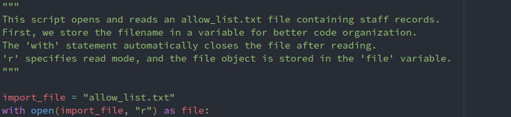
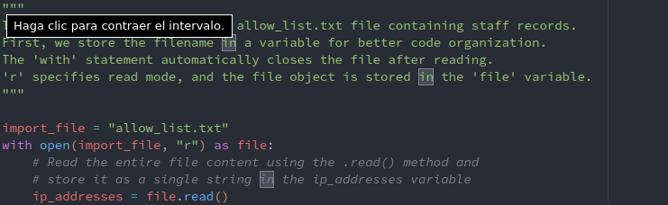
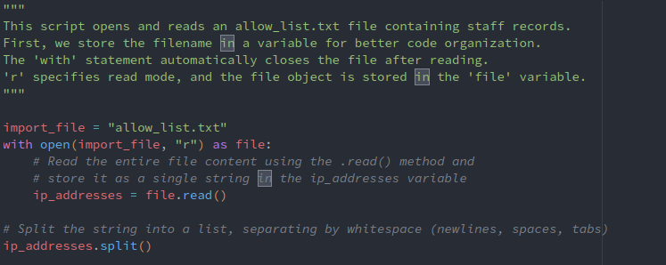
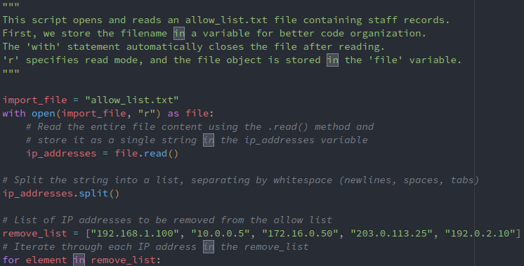
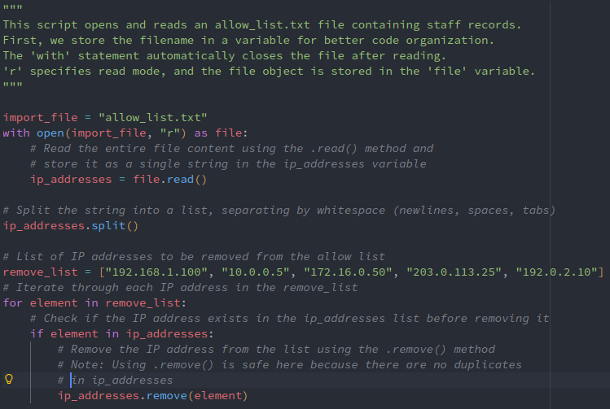
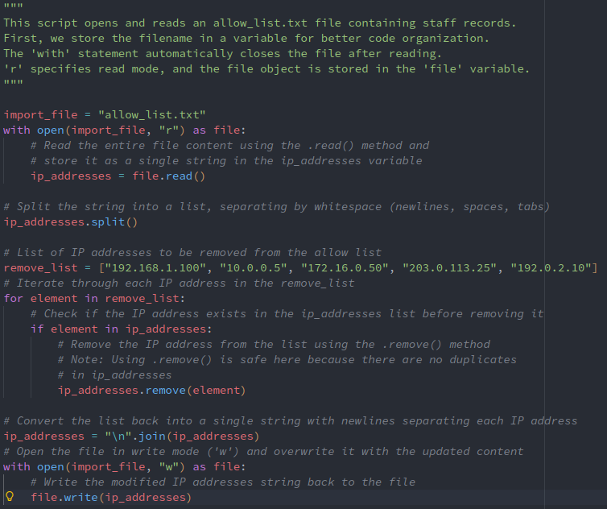

# Scenario
You are a security professional working at a health care company. As part of your job, you're required to regularly update a file that identifies the employees who can access restricted content. The contents of the file are based on who is working with personal patient records. Employees are restricted access based on their IP address. There is an allow list for IP addresses permitted to sign into the restricted subnetwork. There's also a remove list that identifies which employees you must remove from this allow list.

Your task is to create an algorithm that uses Python code to check whether the allow list contains any IP addresses identified on the remove list. If so, you should remove those IP addresses from the file containing the allow list.

---

## Algorithm for file updates in Python

### Project description
As a security professional at a healthcare company, I am responsible for updating an allow list file that controls employee access to restricted patient records based on IP addresses. I have been provided with a remove list containing IP addresses of employees who should no longer have access. My task is to create a Python algorithm that identifies and removes any IP addresses from the allow list that appear in the remove list, ensuring that only authorized personnel can access sensitive medical information. This automated process will help maintain the security and integrity of patient data.

### Open the file that contains the allow list

### Read the file contents

### Convert the string into a list

### Iterate through the remove list

### Remove IP addresses that are on the remove list

### Update the file with the revised list of IP addresses

### Summary
This algorithm automates the process of removing unauthorized IP addresses from an allow list. It begins by reading the contents of an allow_list.txt file and converting the string into a list. The script iterates through a predefined remove_list containing IP addresses that should no longer have access. For each IP address in the remove_list, the algorithm checks if it exists in the allow_list and removes it if found. After all unauthorized IPs have been removed, the updated list is converted back into a string format. Finally, the modified content is written back to the allow_list.txt file, replacing the original data.
