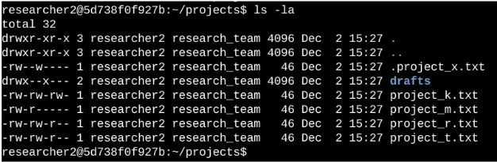

## Scenario

You are a security professional at a large organization. You mainly work with their research team. Part of your job is to ensure users on this team are authorized with the appropriate permissions. This helps keep the system secure. 
Your task is to examine existing permissions on the file system. You’ll need to determine if the permissions match the authorization that should be given. If they do not match, you’ll need to modify the permissions to authorize the appropriate users and remove any unauthorized access.

---

## File permissions in Linux

### Project description
As a member of the investigation team, I am responsible for ensuring that all files adhere to the company’s least privilege policy. During the review, I identified several files requiring permission adjustments to bring them into compliance with organizational security standards.

### Check file and directory details


The image demonstrates that executing the ```ls -la``` command lists all files, including hidden entries, together with their associated permissions. Hidden files are denoted by a leading dot (e.g., ``.project_x.txt``). Additionally, a directory named drafts is present. The initial ten characters of each file entry indicate the file’s permission settings.

### Describe the permissions string
In Linux, each file or directory is represented by a 10-character string that indicates its type and permissions. The first character specifies the file type, where `-` denotes a regular file, `d` a directory, and `l` a symbolic link. The following nine characters are grouped into three sets of three, representing permissions for the owner, the group, and others. Within each set, `r` stands for read, `w` for write, and `x` for execute, while a dash (`-`) indicates that the permission is not granted. For example, the string `-rwxr-xr--` describes a regular file where the owner has full read, write, and execute permissions, the group can read and execute but not write, and others can only read.

### Change file permissions


### Change file permissions on a hidden file

### Change directory permissions

### Summary
